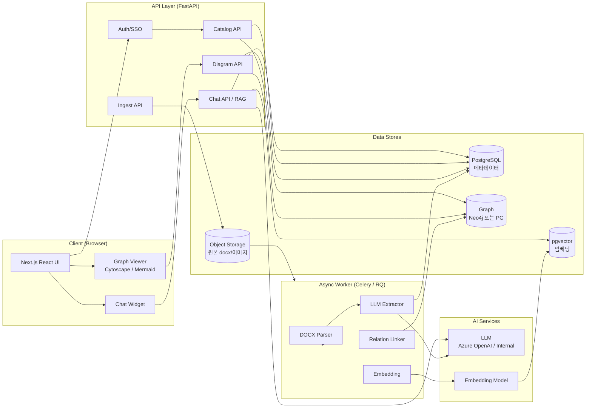
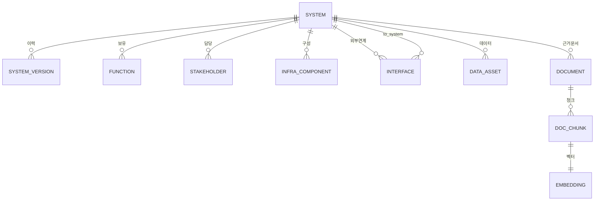
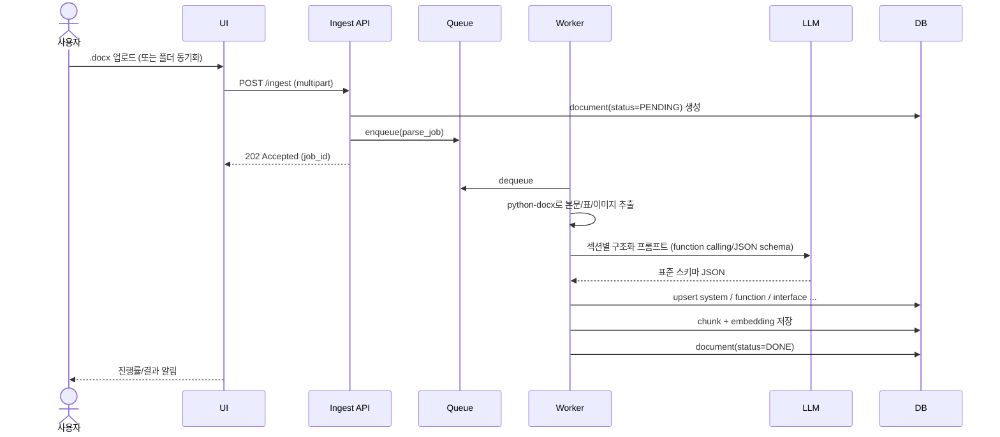
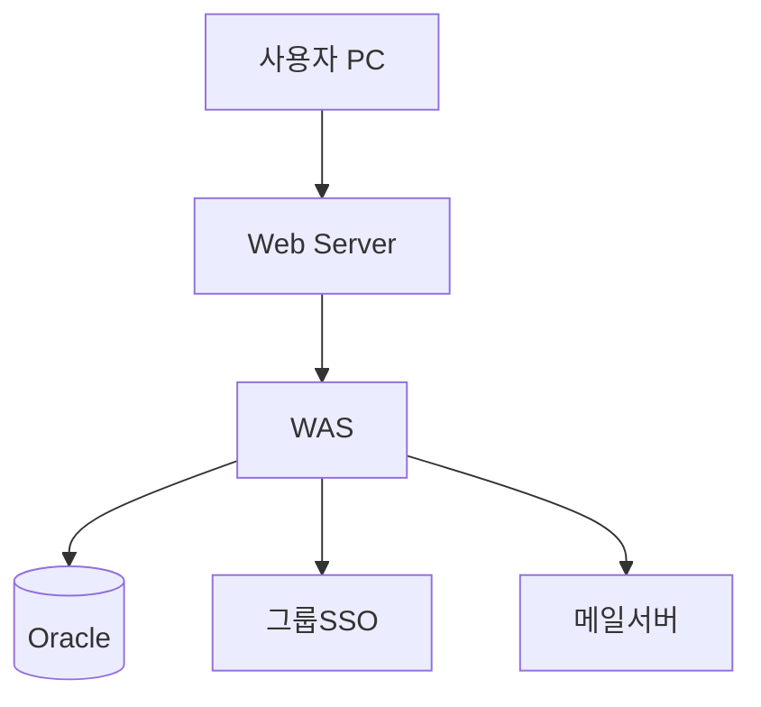

# AI 기반 시스템 카탈로그 앱 설계서

## 1. 개요

### 1.1 목적
사내 다수의 운영매뉴얼(.docx) 문서를 LLM 기반으로 자동 파싱·구조화하여 **시스템 카탈로그**로 적재하고, 사용자가 시스템 정보·연관도·구성도를 손쉽게 조회·생성할 수 있는 AI 어시스턴트 형태의 통합 포털을 구축한다.

### 1.2 배경
- `docs/` 디렉터리에 표준 양식의 운영매뉴얼이 누적 관리됨 (예: 디지털감사시스템, 법무관리, 수익증권, 안전보건관리, HTOPS, NEXTLAB 등)
- 매뉴얼은 비정형(워드)이라 검색·재사용·연관 분석이 어려움
- 시스템 간 의존성·인터페이스 정보가 분산되어 영향도 분석이 수작업

### 1.3 범위
| 구분 | 포함 | 제외 |
| --- | --- | --- |
| 입력 | .docx 운영매뉴얼 업로드 / 폴더 동기화 | 종이 문서, 외부 시스템 직접 연동 |
| 처리 | 텍스트·표·이미지 추출, LLM 구조화, 임베딩 | 코드 정적 분석 |
| 출력 | 카드 뷰, 그래프, 구성도, 챗봇 응답 | BI 대시보드, 보안 감사 리포트 |

---

## 2. 주요 기능 정의

| ID | 기능 | 설명 |
| --- | --- | --- |
| F1 | **매뉴얼 기반 시스템 정보 입력** | .docx 업로드 → 본문/표/이미지 파싱 → LLM이 표준 스키마로 구조화 → DB 적재 |
| F2 | **시스템 정보 조회** | 키워드/필터/시맨틱 검색, 상세 페이지(개요·담당자·기능·인터페이스·이력) |
| F3 | **시스템 간 연관도 출력** | 인터페이스·데이터 흐름 기반 그래프(노드=시스템, 엣지=연계) |
| F4 | **시스템 구성도 출력** | 매뉴얼 추출 정보 + 인프라 구성요소(WAS/DB/외부연계)로 Mermaid/Diagram 자동 생성 |
| F5 | **챗봇 기반 커스터마이징 정보 생성** | 자연어 질의로 RAG 응답, 누락 항목 인터뷰형 보완, 신규 시스템 카드 초안 작성 |

---

## 3. 아키텍처

### 3.1 전체 구성도



### 3.2 기술 스택 (권장)

| 계층 | 기술 | 비고 |
| --- | --- | --- |
| Frontend | Next.js 14, React, TypeScript, TailwindCSS, shadcn/ui | SSR + 정적 페이지 혼합 |
| 그래프/도식 | Cytoscape.js (관계 그래프), Mermaid.js (구성도) | 클라이언트 렌더링 |
| Backend | Python 3.11, FastAPI, Pydantic v2 | 비동기 IO |
| 작업큐 | Celery + Redis (또는 RQ) | DOCX 처리/임베딩 비동기화 |
| DB | PostgreSQL 16 + pgvector | 메타데이터 + 벡터 통합 |
| Graph | Neo4j (옵션) 또는 PG의 인접리스트 + recursive CTE | 규모에 따라 선택 |
| Object Storage | MinIO / Azure Blob / S3 | 원본 docx, 추출 이미지 보관 |
| AI | Azure OpenAI (gpt-4o, text-embedding-3-large) 또는 사내 LLM | 사내 보안 정책 우선 |
| 인증 | OIDC/SAML SSO (사내 IDP), JWT | RBAC |
| 운영 | Docker Compose / Kubernetes, GitHub Actions | IaC: Terraform 옵션 |

---

## 4. 도메인 모델 (시스템 카탈로그 표준 스키마)

운영매뉴얼 양식을 분석해 도출한 표준 카탈로그 엔터티.

### 4.1 ER 개요



### 4.2 주요 테이블

| 테이블 | 핵심 컬럼 | 설명 |
| --- | --- | --- |
| `system` | id, code, name, alias, category, description, owner_org, status, criticality | 시스템 마스터 |
| `system_version` | system_id, rev, effective_date, summary | 매뉴얼 개정이력 (Rev1, Rev2…) |
| `function` | system_id, name, description, screen_path | 주요 기능/화면 |
| `stakeholder` | system_id, role(현업/운영/개발/벤더), name, dept, contact | RACI |
| `infra_component` | system_id, type(WAS/DB/OS/NW/보안), spec, location, env(운영/개발) | 인프라 구성 |
| `interface` | from_system_id, to_system_id, protocol(REST/FTP/DB Link/MQ), direction, data_summary, frequency | 시스템 간 연계 |
| `data_asset` | system_id, name, classification(개인정보/일반), retention | 데이터 자산 |
| `document` | id, system_id, file_path, hash, rev, uploaded_at | 원본 매뉴얼 |
| `doc_chunk` | document_id, section, page, text | 청크 단위 텍스트 |
| `embedding` | chunk_id, vector(pgvector) | 시맨틱 검색용 |
| `audit_log` | actor, action, target, before, after, ts | 변경 추적 |

### 4.3 매뉴얼 → 스키마 매핑(예)

| 매뉴얼 섹션(추정) | 매핑 엔터티 |
| --- | --- |
| 1. 시스템 개요 | `system`, `system_version` |
| 2. 시스템 구성도 | `infra_component` |
| 3. 주요 기능/화면 | `function` |
| 4. 인터페이스 명세 | `interface` |
| 5. 운영 담당자 | `stakeholder` |
| 6. 데이터/백업 | `data_asset` |
| 7. 변경 이력 | `system_version` |

---

## 5. 기능 상세 설계

### 5.1 F1. 매뉴얼 기반 시스템 정보 입력

#### 처리 파이프라인


#### 핵심 처리 로직
- **파서**: `python-docx`로 paragraph/table/inline image 추출 → 섹션 헤더(번호 패턴 `1.`, `1.1`)로 트리화
- **OCR**: 구성도 이미지에 대해 선택적 OCR(Tesseract / Azure DI)로 텍스트 보강
- **LLM 추출**: 섹션 단위 프롬프트, **JSON Schema(=Pydantic 모델)** 강제 → 환각 최소화
- **검증**: Pydantic 검증 실패 시 재시도(temperature 단계 인하), 3회 실패 시 `REVIEW` 상태로 사용자 승인 큐에 적재
- **Idempotency**: `document.hash`(SHA-256)로 중복 업로드 차단, 동일 시스템 신규 Rev은 `system_version` 추가 + diff 보고
- **PII 가드**: 담당자 연락처는 **마스킹 옵션**, RBAC로 접근 제어

#### API
| Method | Path | 설명 |
| --- | --- | --- |
| POST | `/api/ingest/upload` | 단일/다중 파일 업로드 |
| POST | `/api/ingest/sync` | `docs/` 폴더 일괄 동기화 |
| GET | `/api/ingest/jobs/{id}` | 진행 상태 |
| POST | `/api/ingest/jobs/{id}/approve` | 검토 후 승인 적재 |

### 5.2 F2. 시스템 정보 조회

- **검색**: 
  - 키워드(BM25 / PG `tsvector`) + 시맨틱(pgvector cosine) **하이브리드**
  - 필터: 카테고리, 담당부서, 상태, 중요도, 개인정보 보유 여부
- **상세 페이지 구성**: 개요 / 담당자 / 기능 / 인터페이스 / 인프라 / 데이터 / 이력 / 원본 매뉴얼 다운로드
- **출처 표기**: 모든 필드에 "근거 문서 + 페이지/섹션" 링크(클릭 시 원문 미리보기 모달)
- **북마크 / 즐겨찾기 / 공유 URL** 지원

### 5.3 F3. 시스템 간 연관도 출력

- 데이터 소스: `interface` + LLM 추론(매뉴얼 본문 내 시스템명 mention) + 사용자 보정
- 표현: Cytoscape.js force-directed graph
  - 노드 색상: 카테고리별 / 중요도별
  - 엣지 두께: 호출 빈도, 점선=배치, 실선=실시간
- 인터랙션:
  - 노드 클릭 → 상세 패널
  - **"영향도 분석" 모드**: 특정 시스템 장애 시 N-hop 다운스트림 강조
  - 필터: 부서, 프로토콜, 환경(운영/개발)
- 데이터 품질 표시: LLM 추론 엣지는 "검토 필요" 뱃지

### 5.4 F4. 시스템 구성도 출력

- **자동 생성**: `infra_component` + `interface`를 입력으로 LLM이 Mermaid `flowchart` DSL 생성
- **레이어 분리**: Client / Web / WAS / DB / 외부 / 배치
- **편집 모드**: 사용자가 Mermaid 텍스트 직접 수정 → 재렌더 → 저장 시 `infra_component`에 역동기화(LLM 매핑)
- **내보내기**: PNG / SVG / Mermaid 소스 / Draw.io XML(옵션)
- 예시:


### 5.5 F5. 챗봇 기반 커스터마이징 시스템 정보 생성

#### 5.5.1 RAG 파이프라인


#### 5.5.2 모드
| 모드 | 동작 |
| --- | --- |
| **Q&A** | "수익증권 시스템 담당자 누구야?" → 카탈로그+매뉴얼 기반 답변 + 출처 링크 |
| **인터뷰** | 신규/누락 시스템 정보를 단계적 질문으로 수집 → 표준 스키마 JSON 채움 |
| **드래프트** | 미흡한 매뉴얼을 카탈로그 양식 따라 초안 생성, 사용자 승인 후 적재 |
| **변경 시뮬레이션** | "A 시스템 인터페이스를 MQ로 바꾸면?" → 영향 시스템·문서 수정 제안 |

#### 5.5.3 안전 장치
- **Grounding 강제**: retrieval 결과 없으면 "정보 없음" 응답, 환각 방지
- **Citation 의무화**: 모든 사실 답변에 `[doc_id:section]` 인용
- **Tool-use**: `search_catalog`, `get_system`, `propose_update` 함수 정의 → 변경은 항상 사용자 승인 후 commit
- **로그**: 질의/응답/근거를 `audit_log`에 저장 → 추후 학습/감사

---

## 6. UX / 화면 구성

| 화면 | 핵심 요소 |
| --- | --- |
| 홈 | 통합 검색바, 챗봇, 최근 업데이트, 주요 시스템 위젯 |
| 카탈로그 목록 | 카드/표 뷰, 필터, 정렬, 일괄 내보내기 |
| 시스템 상세 | 탭(개요/기능/인터페이스/인프라/데이터/이력/문서) |
| 관계 그래프 | 전체 그래프 + 미니맵 + 필터 + 영향도 모드 토글 |
| 구성도 | Mermaid 뷰어 + 편집기 + 내보내기 |
| 매뉴얼 업로드 | 드래그앤드롭, 진행률, 검토/승인 큐 |
| 챗봇 | 사이드 패널 또는 풀스크린, 인용 카드, 액션 버튼(상세보기/편집제안) |
| 관리자 | 사용자/권한, 추출 품질 리포트, 프롬프트 버전 관리 |

---

## 7. 비기능 요구사항 (NFR)

| 항목 | 목표 |
| --- | --- |
| 성능 | 검색 응답 < 1.5s (P95), 챗봇 응답 첫 토큰 < 2s, 매뉴얼 처리 < 60s/문서 |
| 가용성 | 99.5% 업무시간 |
| 보안 | SSO + RBAC, 전송 TLS, 저장 AES-256, 감사 로그 1년 |
| 개인정보 | 담당자 연락처 마스킹/권한 기반 노출, 다운로드 워터마크 |
| 확장성 | 시스템 1,000건 / 매뉴얼 10,000건 / 동시 사용자 200명 |
| 다국어 | 한국어 우선, 영어 UI 토글 |
| 접근성 | WCAG 2.1 AA |
| 관측성 | OpenTelemetry, LLM 호출 비용/지연 메트릭 대시보드 |

---

## 8. 보안 / 컴플라이언스

- **인증/인가**: 사내 SSO(OIDC), 시스템·부서 단위 ABAC
- **데이터 분류**: 매뉴얼 보안등급에 따라 접근 제어 (대외비 등)
- **LLM 안전**: 사외 LLM 사용 시 PII/대외비 마스킹 후 호출, 가능하면 사내 LLM 우선
- **감사**: 업로드/변경/조회 이력 보존, 다운로드 시 워터마크
- **OWASP**: 입력 검증, SSRF 방지(이미지 URL fetch 제한), Prompt Injection 가드(시스템 프롬프트 분리·툴 호출 화이트리스트)

---

## 9. 데이터 처리 품질 보장

| 단계 | 검증 |
| --- | --- |
| 파싱 | 섹션 누락 비율 ≥ 임계치면 REVIEW 처리 |
| LLM 추출 | JSON Schema 검증 + 필수 필드 완성도 점수 |
| 링크 | 인터페이스 양방향 일관성 검사 (A→B 있으면 B에도 inbound 표시) |
| 사용자 피드백 | 카드별 "정확도 평가" 위젯 → 재학습 데이터화 |

---

## 10. 단계별 로드맵

| 단계 | 산출물 |
| --- | --- |
| **0. PoC** | 단일 매뉴얼 → 카탈로그 카드 + 챗봇 Q&A |
| **1. MVP** | F1·F2 + 기본 인증, 5~10개 매뉴얼 적재 |
| **2. 관계/구성도** | F3·F4 + 편집 흐름 |
| **3. 챗봇 고도화** | F5 인터뷰/드래프트/시뮬레이션 모드 |
| **4. 운영** | SSO, 권한, 감사, 모니터링, 다국어 |
| **5. 확장** | 외부 시스템 메타 연계(CMDB, Jira), 변경 이벤트 자동 반영 |

---

## 11. 리스크 및 대응

| 리스크 | 영향 | 대응 |
| --- | --- | --- |
| LLM 환각 | 잘못된 시스템 정보 | JSON 스키마 강제, citation, 사용자 승인 큐 |
| 매뉴얼 양식 편차 | 추출 실패 | 양식별 프롬프트 템플릿 + few-shot, 휴먼인루프 |
| 매뉴얼 보안등급 노출 | 정보 유출 | 사내 LLM, RBAC, 마스킹 |
| 그래프 폭발 | 시각화 저하 | 카테고리 필터, 클러스터링, N-hop 제한 |
| 비용 (LLM 호출) | 운영비 증가 | 임베딩 캐시, 응답 캐시, 모델 라우팅(작업 난이도별) |

---

## 12. 디렉터리 구조 (제안)

```
system-catalog/
├─ docs/                       # 원본 운영매뉴얼 (.docx)
├─ design/                     # 설계 문서
├─ apps/
│  ├─ web/                     # Next.js
│  └─ api/                     # FastAPI
├─ workers/                    # Celery 작업
│  ├─ parsers/                 # docx 파서
│  ├─ extractors/              # LLM 추출 프롬프트/스키마
│  └─ linkers/                 # 관계 추론
├─ packages/
│  ├─ schemas/                 # Pydantic / TS 공통 스키마
│  └─ ui/                      # 공용 UI 컴포넌트
├─ infra/
│  ├─ docker/
│  └─ k8s/
└─ scripts/                    # 적재/마이그레이션 스크립트
```

---

## 13. 핵심 인터페이스 (API 스펙 발췌)

```yaml
# OpenAPI excerpt
paths:
  /api/systems:
    get:  { summary: 시스템 목록(필터/검색) }
    post: { summary: 시스템 수동 생성 }
  /api/systems/{id}:
    get: { summary: 상세 조회 }
    patch: { summary: 부분 수정(감사 로그 자동) }
  /api/systems/{id}/relations:
    get: { summary: 관계 그래프(JSON) }
  /api/systems/{id}/diagram:
    get: { summary: 구성도 Mermaid 소스 }
    put: { summary: 구성도 저장 }
  /api/ingest/upload:
    post: { summary: 매뉴얼 업로드 }
  /api/chat:
    post: { summary: 챗봇 질의(SSE 스트리밍) }
```

---

## 14. 참고 사항

- 본 설계는 `docs/`의 12종 매뉴얼(디지털감사, 라이프플러스아카데미, 법무관리, 사회공헌, 수익증권, 아름다운선물서비스, 안전보건관리, 전자도서관, HTOPS, NEXTLAB GA모바일위촉, NEXTLAB 보유고객향오퍼링, 내부통제) 양식 분석을 전제로 한다.
- 매뉴얼 표준 양식이 사내 별도 정의되어 있다면, **§4.3 매핑 표**를 해당 양식 목차에 맞춰 정렬·고도화한다.
- LLM 모델 선정은 사내 보안/조달 정책에 따라 최종 확정한다.
